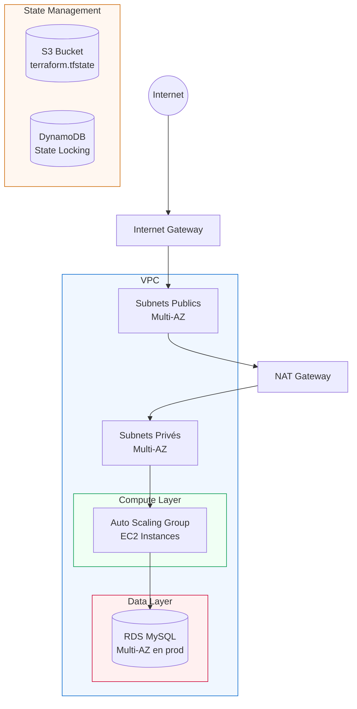

# 🏗️ AWS Multi-Environment Infrastructure — Terraform


Infrastructure AWS complète (VPC, EC2 avec Auto Scaling, RDS MySQL) provisionnée avec **Terraform**,
organisée en **modules réutilisables** et déployée sur **3 environnements isolés** (dev, staging, prod)
avec state distant sécurisé (S3 + DynamoDB).

---

## 📋 Sommaire

- [Architecture](#-architecture)
- [Fonctionnalités](#-fonctionnalités)
- [Structure du projet](#-structure-du-projet)
- [Prérequis](#-prérequis)
- [Démarrage rapide](#-démarrage-rapide)
- [Comparatif des environnements](#-comparatif-des-environnements)
- [Sécurité](#-sécurité--bonnes-pratiques)
- [Roadmap](#-roadmap)

---

## 🏛️ Architecture



## ✨ Fonctionnalités

- 🔁 **Modules réutilisables** — un seul code source pour `dev`, `staging` et `prod`
- 🔒 **State distant sécurisé** — backend S3 chiffré + verrouillage DynamoDB (pas de conflit en équipe)
- 💰 **Coûts maîtrisés en dev** — NAT Gateway désactivé, instances minimales
- 🛡️ **Production protégée** — `deletion_protection`, RDS Multi-AZ, backups 7 jours
- 🔐 **Secrets externalisés** — aucun mot de passe en dur, injection via variables d'environnement
- 📐 **Réseau isolé par couche** — subnets publics (NAT/LB) et privés (compute/data) séparés

## 📁 Structure du projet

```
terraform-aws-multi-env/
├── backend-setup/          # Bootstrap : bucket S3 + table DynamoDB (déploiement unique)
│   ├── main.tf
│   ├── variables.tf
│   └── outputs.tf
├── modules/
│   ├── vpc/                 # VPC, subnets publics/privés, IGW, NAT Gateway
│   ├── security-groups/     # Security Groups web + base de données
│   ├── ec2/                 # Launch Template + Auto Scaling Group
│   └── rds/                 # Base de données MySQL managée
└── environments/
    ├── dev/                 # 1 instance t2.micro — sans NAT (économie)
    ├── staging/              # 2 instances t3.small — avec NAT
    └── prod/                 # 2-6 instances t3.medium — RDS Multi-AZ
```

## ✅ Prérequis

| Outil | Version minimale | Installation |
|---|---|---|
| Terraform | 1.5+ | `winget install HashiCorp.Terraform` |
| AWS CLI | 2.x | `winget install Amazon.AWSCLI` |
| Compte AWS | — | avec credentials configurés (`aws configure`) |

## 🚀 Démarrage rapide

### 1. Bootstrap du backend distant (une seule fois)

```bash
cd backend-setup
terraform init
terraform apply -var="state_bucket_name=ton-nom-unique-2026"
```

### 2. Configurer le backend de chaque environnement

Remplace `REPLACE-WITH-YOUR-STATE-BUCKET-NAME` par le nom choisi ci-dessus
dans chaque `environments/*/backend.tf`.

### 3. Déployer un environnement

```bash
cd environments/dev
cp terraform.tfvars.example terraform.tfvars   # puis édite ton IP publique
export TF_VAR_db_password="un-mot-de-passe-solide"

terraform init
terraform plan
terraform apply
```

### 4. Détruire l'environnement (nettoyage)

```bash
terraform destroy
```

## ⚖️ Comparatif des environnements

| Paramètre | Dev | Staging | Prod |
|---|:---:|:---:|:---:|
| NAT Gateway | ❌ | ✅ | ✅ |
| Instance EC2 | `t2.micro` | `t3.small` | `t3.medium` |
| Auto Scaling (min-max) | 1-1 | 1-3 | 2-6 |
| Instance RDS | `db.t3.micro` | `db.t3.small` | `db.t3.medium` |
| RDS Multi-AZ | ❌ | ❌ | ✅ |
| Deletion protection | ❌ | ❌ | ✅ |
| Rétention backups | 1 jour | 1 jour | 7 jours |

## 🔐 Sécurité & bonnes pratiques

- ✅ State chiffré au repos + versionné (rollback possible en cas d'erreur)
- ✅ Aucun secret commité — `.tfvars` réels exclus via `.gitignore`, mot de passe via `TF_VAR_*`
- ✅ Base de données jamais exposée publiquement — accès restreint au Security Group applicatif uniquement
- ✅ Accès SSH restreint par IP (`ssh_allowed_cidrs`), jamais ouvert à `0.0.0.0/0` en usage réel

## 🗺️ Roadmap

- [ ] Pipeline CI/CD (GitHub Actions) avec `terraform plan` automatique sur chaque Pull Request
- [ ] Migration du module EC2 vers un module EKS
- [ ] Intégration HashiCorp Vault pour la gestion des secrets
- [ ] Tests automatisés avec Terratest

---

**Auteur** — Mohamed Aziz Becheikh · [GitHub](https://github.com/azizbh799-alt) · [LinkedIn](https://linkedin.com/in/azizbechikh)
